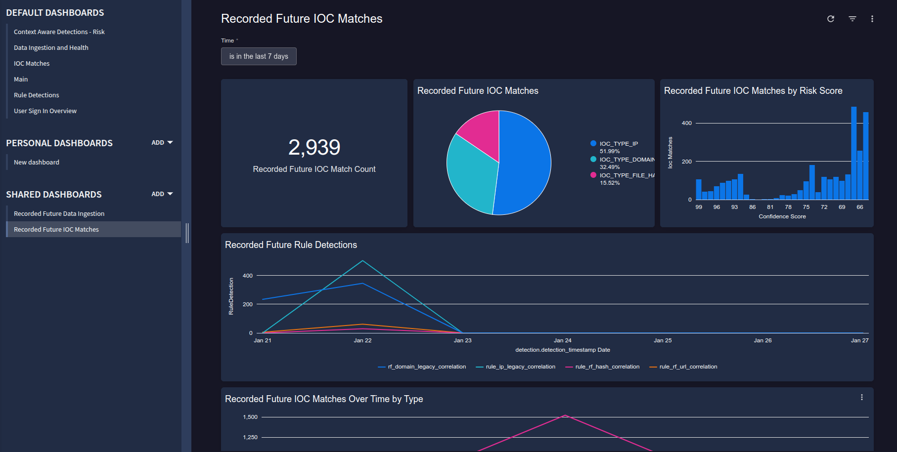

[](https://www.recordedfuture.com/)

# Recorded Future Risklists for Google Chronicle

## Overview

Instructions for how to deploy ingestion scripts to import Recorded Future Indicators of Compromise into Google SecOps SIEM. These scripts as deployed as Google Cloud Run Functions. Recorded Future is the world's largest provider of intelligence for enterprise security. By seamlessly combining automated data collection, pervasive analytics, and expert human analysis, Recorded Future delivers timely, accurate, and actionable intelligence.

Contact: [support@recordedfuture.com](mailto:support@recordedfuture.com)

### Updates over legacy version

These ingestion scripts contain significant updates over the [legacy integration](https://cloud.google.com/chronicle/docs/reference/feed-management-api#recorded-future-ioc), notably:

- Expands IoC types to include File Hashes and URLs
- Ages out old IoCs correctly to prevent false positives
- Allows for the selection of custom risklists
- Parses indicators efficiently to reduce ingestion size
- Populates UDM fields to more closely align with Google SecOps best practices
- Includes Yara-L rules to correlate threat intelligence against
- Includes dashboards to get a global view of Recorded Future Threat intelligence in your SIEM environment

## Prerequisites

Before Installing the ingestion script, you must take the following steps

- Acquire a Recorded Future API Token and place it in GCP secrets manager. Note the path of the secret and use it for the `RECORDED_FUTURE_SECRET` value in .env.yml
- Acquire Google SecOps credentials from the SecOps console at SIEM Settings->Collection Agents->Ingestion Authentication File. Place it in GCP secrets manager and use it for the `CHRONICLE_SERVICE_ACCOUNT` value in .env.yml
- Create (or use an existing service account) and use it's email in the `<SERVICE_ACCOUNT_EMAIL>` placeholders specified below. Assign the Service Account the following permissions
    - `Cloud Functions Invoker`
    - `Cloud Run Invoker`
    - `Service Account User`
    - `Secret Manager Secret Accessor`. Although this permission can be granted project-wide, best practice is to grant only for the two secrets created above

## Installation

Complete the following installation steps from inside the `src` directory

### Environment variables

Set environment variables in `.env.yaml`. Below are the Recorded Future specific ones

| Variable                   | Description                                                                                                                 | Required | Default | Secret |
| -------------------------- | --------------------------------------------------------------------------------------------------------------------------- | -------- | ------- | ------ |
| RECORDED_FUTURE_SECRET              | GCP path to the secret containing the Recorded Future API token.| Yes       |   -      | Yes     |
| RECORDED_FUTURE_FUSION_PATH_DOMAIN              | Fusion Path to Domain Risk List to be ingested. "default" uses default domain risk list                                                           | Yes      | default       | No     |
| RECORDED_FUTURE_FUSION_PATH_IP              | Fusion Path to IP Risk List to be ingested. "default" uses default IP risk list                                                           | Yes      | default       | No     |
| RECORDED_FUTURE_FUSION_PATH_URL              | Fusion Path to URL Risk List to be ingested. "default" uses default URL risk list                                                           | Yes      | default       | No     |
| RECORDED_FUTURE_FUSION_PATH_HASH              | Fusion Path to Hash Risk List to be ingested. "default" uses default Hash risk list                                                           | Yes      | default       | No     |
| RECORDED_FUTURE_OFFSET              | Sets the expiration time for Recorded Future IoCs. Should be an int followed by `d` (days) or `h` (hours). Should be set equal to the update run frequency of the Cloud Run Function                                                         | Yes      | 1d       | No     |

### Copy common

Copy the `common` directory from this repository into the `src` directory

### Install & Schedule Ingestion Script

When deploying the Function, the attached Service Account must have the `Cloud Functions Invoker`, `Cloud Run Invoker`, `Secret Manager Secret Accessor`, and `Service Account User` roles. Full documentation on Cloud Run Functions can be found [here](https://cloud.google.com/chronicle/docs/ingestion/ingest-using-cloud-functions). If you decide to create the Cloud Run Function manually in the console, make sure you give it at least 2gb of memory and a timeout of at least 30 minutes

You can find full instructions on deploying ingestion scripts as cloud fun functions [here](https://cloud.google.com/chronicle/docs/ingestion/ingest-using-cloud-functions) and [here](https://github.com/chronicle/ingestion-scripts/blob/main/README.md). Alternatively, follow the step-by-step instructions below

Deploy the ingestion script following using the following gcloud CLI command while inside the `src` directory

```
 gcloud functions deploy rf_ingest --entry-point main --trigger-http --runtime python311 --env-vars-file .env.yml -service-account <SERVICE_ACCOUNT_EMAIL> --memory 2048MB --timeout=3600s

```

 After deploying the script, make sure you schedule it to run regularly by creating a Cloud Scheduler Job. The script should be scheduled to run at least daily. You can also configure the scheduler through the UI from [this documentation](https://cloud.google.com/run/docs/triggering/using-scheduler). We recommend setting the timeout/deadline value to 30 minutes

 You can create a job with gcloud cli with the below command

```
gcloud scheduler jobs create http rf-secops-ingest --schedule="0 0 * * *" --uri="<PATH_OF_RUN_FUNCTION_URL>" --oidc-service-account-email=<SERVICE_ACCOUNT_EMAIL> --http-method=POST --attempt-deadline 30m
```

### Install New Parser

You will need to create a custom parser based on the existing Recorded Future parser by following the instructions [here](https://cloud.google.com/chronicle/docs/event-processing/manage-parser-updates#create_custom_parser_from_existing_parser). Select `Recorded Future` as the Log Source in Step 3. In Step 6, replace the existing parser with the logstash parser found at `parsers/standard_risklist.conf` in this repository.

You **must** run the ingest script at least once before Google SecOps will let you create the new parser

**If you do not install the new parser you will not get the full benefit of the integration**


### Install Correlation Rules

You can create URL rules in the Google Secops console by navigating to Detection->Rules & Detections->Rules Editor->New. We've provided four YARA-L rules in the `correlation_rules` directory to import. After creating the rules, make sure to activate them and set them to a run frequency of at least once daily


### Install Dashboards

There are two dashboards that come with this integration:

- A health dashboard that monitors ingestion of Recorded Future data
- A correlation dashboard that shows malicious IoCs detected in your environment

You can import these from the `dashboards` directory by following [these instructions](https://cloud.google.com/chronicle/docs/reports/import-export-dashboards#import_dashboards)

## Usage

### IOC Matching

The Recorded Future ingestion script integrates seamlessly with the IOC matching service in Google SecOps. As soon as our data is ingested, it will automatically match with IoCs in your environment. You can view these matches at Detections->Alerts & IOCS-> IOC Matches. Google SecOps IOC matching only supports Hashes, IPs, and Domains


### Correlation Rules

You can use the correlation rules provided to generate alerts when Recorded Future detects a malicious IoCs in your environment. The Risk Score of the Alert will be set equal to the Recorded Future Risk Score. Yara-L supports all Recorded Future IOC types: IPs, Domains, URLs, and Hashes

You can find our rules in the Google SecOps console at Detection->Rules & Detections->Rules Editor


You can find the alerts Recorded Future rules generates in the Google SecOps console at Detections->Alerts & IOCS-> Alerts


By default, the rules look at an extremely wide dataset to correlate against. We recommend you apply additional filtering (by log vendor, action, machine type etc.) to tune the rules to increase performance

### Dashboards

Recorded Future has provided two dashboards to more easily visualize and summarize data from the integration

#### Recorded Future Data Ingestion


This dashboard shows information about the health of the integration. If there have been unusual spikes or dips in data ingestion


#### Recorded Future IOC Matches


This dashboard shows an overview of malicious Indicators of Compromise Recorded Future has identified in your Google SecOps environment. These detections are sourced from both the built-in IOC matching service and the Yara-L rules that ship with this integration


