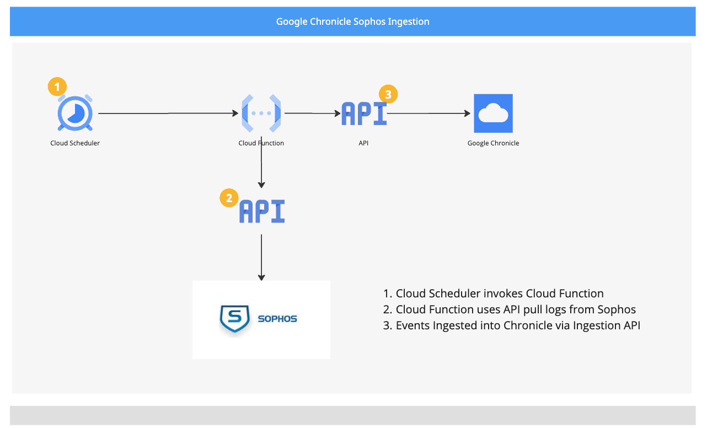

# Chronicle Ingestion Cloud Function Sophos Central 

This script is for fetching the logs from Sophos Central and ingesting to Chronicle.

Chronicle LOG_TYPE:  SOPHOS_CENTRAL

## Reference Documentation

[Google Chronicle 3rd Party Ingestion Scripts](https://github.com/chronicle/ingestion-scripts)

## Platform Specific Environment Variables
| Variable                  | Description                                                                                  | Required | Default | Secret |
| ------------------------- | -------------------------------------------------------------------------------------------- | -------- | ------- | ------ |
| CHRONICLE_CUSTOMER_ID | Chronicle customer ID. | Yes | - | No |
| CHRONICLE_REGION | Chronicle region. | Yes | us | No |
| CHRONICLE_SERVICE_ACCOUNT | Contents of the Chronicle ServiceAccount JSON file. | Yes | - | Yes |
| CHRONICLE_NAMESPACE | The namespace that the Chronicle logs are labeled with. | No | - | No |
| POLL_INTERVAL | Frequency interval at which the function executes to get additional log data (in minutes). This duration must be the same as the Cloud Scheduler job interval. | Yes | 10 | No |
| SOPHOS_AUTH_URL | Sophos Auth URL | Yes | - | No |
| SOPHOS_CLIENT_ID | Sophos Client ID | Yes | - | Yes |
| SOPHOS_CLIENT_SECRET | Sophos Client Secret | Yes | - | Yes |
| SOPHOS_TENANT_ID = | Sophos Tenant ID | Yes | - | Yes |
| SOPHOS_EVENTS_URL | Sophos Events API URL | Yes | - | No |
| SOPHOS_ALERTS_URL | Sophos Alerts API URL | Yes | - | No |

## Sophos Central API

There are 2 apis polled using the cloud function.

Documentation can be found here:

https://developer.sophos.com/docs/siem-v1/1/overview

1. Events: (https://developer.sophos.com/docs/siem-v1/1/routes/events/get)
2. Alerts: (https://developer.sophos.com/docs/siem-v1/1/routes/events/get)


The results of the api query return a JSON object, containing an array of JSON logs.


### Authentication

APi authentication is via a JWT, using the following URL and payload

```
# Sophos Central Authentication URL
auth_url = 'https://id.sophos.com/api/v2/oauth2/token'

# Request payload for obtaining JWT token
payload = {
    'grant_type': 'client_credentials',
    'client_id': client_id,
    'client_secret': client_secret,
    'scope': 'token'
}
```

### API variables

The API URL is polled using GET using the from_date paramater, using the JWT from the previous request.

Tenant ID is the Sophos tenant ID.

Date is in unix epoch format.

```
url = f"{sophos_url}?from_date={epoch_start_time}"

  headers = {
        'Authorization': f'Bearer {token}',
        'Content-Type': 'application/json',
        'X-Tenant-ID': tenant_id
    }
```

### Ingestion

The response json is returned as the response. A list is created by iterating the items array.
The list is then looped and ingested into Chronicle.

The ingest function takes care of batching the logs into lots of 100 due to Ingestion API maximum message size limitation of 1MB.

[FAQ Ingestion API](https://cloud.google.com/chronicle/docs/reference/ingestion-api)

```
  response = resp.json()
  <SNIP>
  data_list.extend(iter(response["items"]))
  print(f"Retrieved {len(data_list)} Sophos logs from the last"
        " API call.")

  # Ingest data into Chronicle.
  ingest.ingest(data_list, CHRONICLE_DATA_TYPE)
```


## Cloud Function Generic Setup

### Setting up the directory

Create a new directory for the cloud function deployment and add the
following files into that directory:

1. *Contents* of ingestion script (i.e. `armis`)
2. `common` directory

### Setting the required runtime environment variables

Edit the .env.yml file to populate all the required environment variables.
Information related to all the environment variables can be found in this file.

#### Using secrets

Environment variables marked as **Secret** must be configured as secrets on
Google Secret Manager. Refer [this](https://cloud.google.com/secret-manager/docs/creating-and-accessing-secrets#create)
page to learn how to create secrets.

Once the secrets are created on Secret Manager, use the secret's resource name
as the value for environment variables. For example:

```
CHRONICLE_SERVICE_ACCOUNT: projects/{project_id}/secrets/{secret_id}/versions/{version_id}
```

#### Configuring the namespace

The namespace that the Chronicle logs are ingested into can be configured by
setting the `CHRONICLE_NAMESPACE` environment variable.

### Deploying the cloud function

Execute the following command from inside the previously created directory to 
deploy the cloud function.

```
gcloud functions deploy <FUNCTION NAME> --gen2 --entry-point main --trigger-http --runtime python39 --env-vars-file .env.yml
```

### Cloud Function Default Specifications

| Variable | Default Value | Description |
| --- | --- | --- |
| Memory | 256 MB | Allocated memory for a specific cloud function. |
| Timeout | 60 seconds | Time Interval for the termination of a cloud function. |
| Region | us-central1 | Region for a cloud function. |
| Minimum instances | 0 | Minimum number of instance for a cloud function. |
| Maximum instances | 100 | Maximum number of instances for a cloud function. |

- The configuration documentation of the above variables can be found here: [link](https://cloud.google.com/functions/docs/configuring)

## Steps to fetch the historical data all at once and then continue with the real-time data collection

- Configure POLL_INTERVAL environment variable in minutes for which the historical data needs to be fetched.
- As the cloud function is configured, the function can be triggered using a scheduler or manually by executing the command in Google Cloud CLI.

## Resources

- [Install the gcloud CLI](https://cloud.google.com/sdk/docs/install)
- [Deploying cloud functions from local machine](https://cloud.google.com/functions/docs/deploying/filesystem)


## Cloud Function Requirements


### Resources

1. Cloud Function Job
2. Cloud Scheduler Job
3. API Secrets


### Service Account Permissions

1. Secrets Manger Secret Accessor
2. Cloud Functions Developer


## Prerequisites - Google


A service account with Ingestion API permissions

A GCP Project for the Cloud Function (and Compute instance if cloud based)


## Prerequisites IAM

The GCP service account needs the following roles:

* Secret Manager Secret Accessor
* Cloud Functions Developer


## Deploy Cloud Function

**Cloud Function Design**


### Overview Steps to Deploy the Cloud Function

1. Create a service account with roles in IAM prerequisites
2. Create Secrets for Chronicle Service account and API Key 
3. Update environment variables
4. Upload python code to cli console
5. Deploy the Cloud Function
  

#### 1. IAM

Create a service account or use an existing one.


#### 2. Create Secrets in Secrets Manager

Create thesecrets in secrets manager

1. Click Create Secret
2. Give it a name
3. Paste the secret value
4. Create Secret
5. Copy the link to the secret for the .env.yml file

Secret strings take the following form:

projects/{project_id}/secrets/{secret_id}/versions/{version_id} 

#### 3. Populate Environment Variables

Update variables in .env.yaml

#### 4. Upload Python code

Create a new directory for the cloud function deployment and add the following files into that directory:

* Contents of the desired platform (if it exists, otherwise copy a similar one)
* common directory
* Edit the .env.yml file to populate all the required environment variables.

For existing 3rd party ingestion scripts Main.py will be filled in.
If not you will have to customise main.py.

Upload to the cloud console.

#### 6. Deployment Cloud Console Cloud Shell 

**Deploy using the following command:**

Substitute items in <<>> Service Account Name and  Function Name


```
gcloud functions deploy <<FUNCTIONNAME>> --gen2 --service-account <SERVICEACCOUNTNAME@PROJECT.iam.gserviceaccount.com> --region australia-southeast1 --entry-point main --trigger-http --runtime python311 --env-vars-file .env.yml
```

gcloud functions deploy <<FUNCTIONNAME>> --gen2 --service-account SERVICEACCOUNTNAME@PROJECT.iam.gserviceaccount.com --region australia-southeast1 --entry-point main --trigger-http --runtime python311 --env-vars-file .env.yml

 Note: Python 3.11 os the most current a the time of writing.
The common libraries may only work for the version above.


**Retrieve Cloud function Target URL**

1. Get the Target URL for the Cloud Scheduler
2. In the cloud function, click the Trigger Tab, copy the Trigger URL.


## Cloud Scheduler

Schedule the cloud function to run as per your desired frequency.

1. Create Job
2. Give appropriate name and description
3. Choose region
4. Frequency set as every mins  */10 * * * *
5. Set the timezone
6. Set Target as HTTP,  URL is the trigger URL in the cloud function
7. Auth header: Add OIDC Token
8. Set Service Account to Chronicle service account
9. Method POST
10. Create Schedule


## Troubleshooting

Cloud functions create logs under the Logs tab in the Cloud Run Function Console

