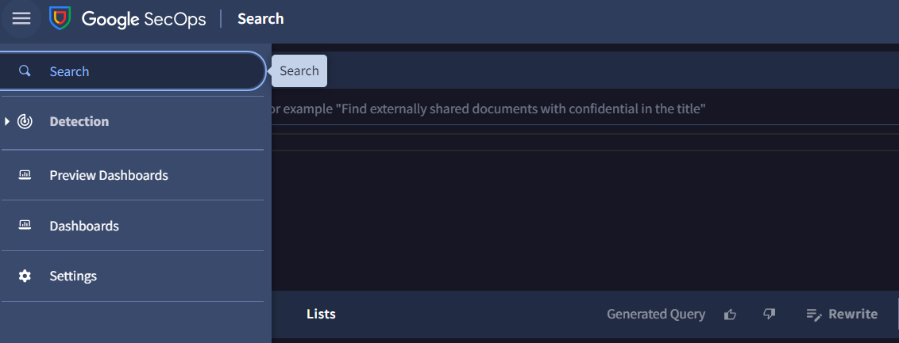
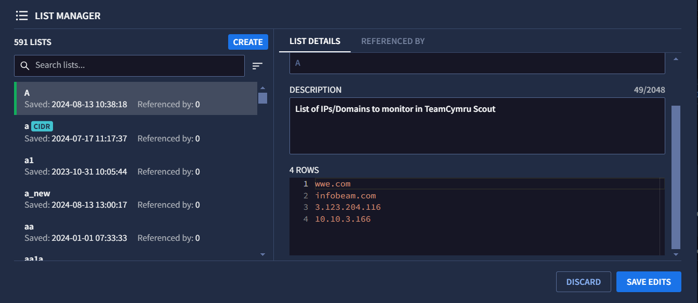
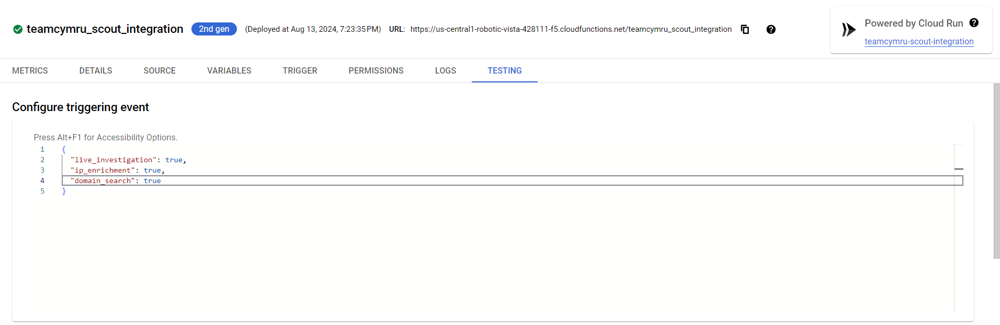

# TeamCymru Scout Chronicle Integration

The Chronicle App for TeamCymru Scout fetches real-time events from the Chronicle and extracts ips/domains for further enrichment from TeamCymru Scout APIs. This app allows users to leverage the ad-hoc enrichment of ips/domains when in need. This also contains Looker dashboards where users can visualize different metrics

### The overall flow of the script:
- Deploying the script to Cloud Function
- Data collection using ingestion script from the Chronicle
- Enrich IPs/Domains from the TeamCymru Scout
- Ingest enriched ip/domain data into Chronicle
- Collected data will be parsed through corresponding parsers in Chronicle

### Pre-Requisites
- Chronicle console and Chronicle service account.
- TeamCymru Scout credentials ((API username, API password)/ API key)
- GCP Project with the below required permissions:
  - GCP user and project service account should have Owner permissions
- GCP Services
   - Memory store - Redis
   - Cloud function (4-core CPU or higher is recommended for cloud function configuration)
   - GCS bucket
   - Secret Manager
   - Cloud Scheduler
   - Serverless VPC access

### Environment Variables

| Variable | Description | Required | Default | Secret |
| --- | --- | --- | --- | --- |
| CHRONICLE_CUSTOMER_ID | Chronicle customer ID. Navigate to settings in the Chronicle console for the customer ID. | Yes | - | No |
| CHRONICLE_SERVICE_ACCOUNT | Copied resource name value of service account secret from the secret manager. | Yes | - | Yes |
| CHRONICLE_REGION | A region where the Chronicle instance is located. | No | us | No |
| GCP_BUCKET_NAME | Name of the created GCP bucket. | Yes | - | No |
| REDIS_HOST | IP of the created Redis memory store. | Yes | - | No |
| REDIS_PORT | Port of the created Redis memory store. | Yes | - | No |
| LOG_FETCH_DURATION | Time duration in seconds to fetch events from the Chronicle. Provide an integer value. Eg. Fetch events every 5 minutes with 300 seconds. | No | 60 | No |
| CHECKPOINT_FILE_PATH | Path of the checkpoint file if provided in the bucket. Specify the JSON format {"time": "YYYY-MM-DD hh:mm:ss"}. | No | - | No |
| FETCH_DOMAIN_EVENTS | Flag to fetch Domain-aware events from the Chronicle. Accepted values [true, false]. | No | false | No |
| LOG_TYPE_FILE_PATH | Path of Log type file name if provided in the bucket. Specify comma-separated values for ingestion labels. | No | - | No |
| PROVISIONAL_TTL | TTL (time to leave) value for enriched IP from IP Detail API in Redis cache (in days). | No | 30 days | No |
| TEAMCYMRU_SCOUT_AUTH_TYPE | Type of authentication for API calls (basic_auth/api_key). | Yes | - | No |
| TEAMCYMRU_SCOUT_ACCOUNT_NAME | Unique account name of TeamCymru Scout account. | Yes | - | No |
| TEAMCYMRU_SCOUT_API_USERNAME | Copied resource name value of TeamCymru Scout API username secret from the secret manager. Required for basic_auth. | No | - | Yes |
| TEAMCYMRU_SCOUT_API_PASSWORD | Copied resource name value of TeamCymru Scout API password secret from the secret manager. Required for basic_auth. | No | - | Yes |
| TEAMCYMRU_SCOUT_API_KEY | Copied resource name value of TeamCymru Scout API key secret from the secret manager. Required for api_key. | No | - | Yes |
| IP_ENRICHMENT_LIST | Name of the IP enrichment reference list created in the Chronicle. | No | - | No |
| DOMAIN_SEARCH_LIST | Name of the Domain Search reference list created in the Chronicle. | No | - | No |
| LIVE_INVESTIGATION_LIST | Name of the live investigation reference list created in the Chronicle. | No | - | No |
| IP_ENRICHMENT_SIZE | Size of the response in records to return for IP Detail enrichment API. Min: 1, Max: 1000. | No | 200 | No |
| IP_ENRICHMENT_TAGS | Tags from foundation details for which IP needs to be enriched. Comma-separated values. | No | suspicious,malicious | No |
| FORCE_IP_ENRICHMENT_DETAIL | If true, IP Detail API will be called directly for ip_enrichment ad-hoc feature. | No | false | No |
  

### Creating zip of the cloud function
Create a zip file of the cloud function with the contents of the following files:
1. Contents of the ingestion script (i.e. `teamcymru_scout`)
2. `common` directory

### Command based(automated) deployment of the required GCP resources
1. Perform each steps mention below to setup resource(s):
   1. Create Redis and Bucket: 
      - Log in to the Google Cloud Console "https://console.cloud.google.com/"
      - Select the project created for the TeamCymru Scout from the upper left side dropdown.
      - Click on the Activate Cloud Shell button.
      - Click on the Open Editor button after Cloud Shell opens successfully.
      - Create a new file and add the below code to the file. The file type should be jinja. (e.g. resource.jinja)
        ```jinja
        resources:
        - name: {{ properties["name"] }}
          type: gcp-types/redis-v1:projects.locations.instances
          properties:
             parent: projects/{{ env["project"] }}/locations/{{ properties["region"] }}
             instanceId: {{ properties["name"] }}
             authorizedNetwork: projects/{{ env["project"] }}/global/networks/default
             memorySizeGb: {{ properties["memory"] }}
             tier: STANDARD_HA
             
             displayName: {{ properties["displayName"] }}
             
        ```
      - Create another file and copy below code to that file. The file should be in yaml format. (e.g. config.yaml)
        ```yaml
          imports:
          - path: RESOURCE_FILE_NAME
          resources:
          - name: REDIS_INSTANCE_NAME
            type: RESOURCE_FILE_NAME
            properties:
             name: REDIS_INSTANCE_NAME
             region: us-central1
             memory: 2
             displayName: redis_display_name
          - name: BUCKET_NAME
            type: storage.v1.bucket
            properties:
            location: US
         ```
          - **RESOURCE_FILE_NAME**: Name of the created resource file(e.g. resource.jinja).  
          - **REDIS_INSTANCE_NAME**: Unique name of the Redis instance.  
          - **BUCKET_NAME**: Unique name of the bucket.
   
      - Now click on the Open Terminal and hit the below command.

         `gcloud deployment-manager deployments create NAME_OF_DEPLOY --config NAME_OF_CONFIG_FILE`

         - **NAME_OF_DEPLOY**: Unique name of the deployment manager.

         - **NAME_OF_CONFIG_FILE**: Name of the created config file (e.g. config.yaml).

         If deployment is unsuccessful, a user has to delete the deployment manager instance and create it again. To delete the deployment manager, hit the below command.

         `gcloud deployment-manager deployments delete NAME_OF_DEPLOY`
      
   2. Create a Serverless VPC Access:
      - Hit the below command in the terminal after the deployment manager is created successfully.
      
        `gcloud compute networks vpc-access connectors create VPC_NAME --network default  --region REGION --range IP_RANGE`
      - **VPC_NAME**: Unique name of the VPC.
      - **REGION**: A region for your connector. Values can be  us-central1, us-west1, etc.
      - **IP_RANGE**: An unreserved internal IP network and a /28 of unallocated space is required. The value supplied is the network in CIDR notation (10.0.0.0/28). This IP range must not overlap with any existing IP address reservations in your VPC network.
   3. Create a Cloud function
      - Navigate to the bucket and open the bucket created for the TeamCymru Scout. Upload the cloud function zip file in the bucket.
      - Hit the below command in the terminal after the VPC network is created successfully.
  
          `gcloud functions deploy CLOUD_FUNCTION_NAME --set-env-vars ENV_NAME1=ENV_VALUE1,ENV_NAME2=ENV_VALUE2,ENV_NAME3=  --gen2 --runtime=python311 --region=us-central1 --source=SOURCE_OF_FUNCTION  --entry-point=main --service-account=SERVICE_ACCOUNT_EMAIL --trigger-http --no-allow-unauthenticated --memory=8GiB --vpc-connector=VPC_NAME --egress-settings=private-ranges-only --timeout=3600s`

      - **CLOUD_FUNCTION_NAME**: Unique name of the cloud function.
      - **SOURCE_OF_FUNCTION**: gsutil URI of the cloud function zip in cloud storage. (e.g. gs://teamcymru_scout/function.zip) where the teamcymru_scout is the name of the created bucket and function.zip is the cloud function zip file.
      - **SERVICE_ACCOUNT_EMAIL**: Email of the created service account of the project.
      - **VPC_NAME**: Name of the created VPC Network.
      - **ENV_NAME1**=**ENV_VALUE1**: Name and value of the environment variable to be created. For optional environment variables, provide **ENV_NAME=**

         The user has to provide all the required environment variables while creating the cloud function. The optional environment variables can also be provided after the cloud function is deployed by editing the cloud function.
   4. Create a Cloud Scheduler:

      - Hit the below command in the terminal after the cloud function is created successfully.
  
         `gcloud scheduler jobs create http SCHEDULER_NAME --schedule="CRON_TIME" --uri="CLOUD_FUNCTION_URL" --attempt-deadline=30m --oidc-service-account-email=SERVICE_ACCOUNT_EMAIL --location=LOCATION`

      - **SCHEDULER_NAME**: Unique name of the cloud scheduler.
      - **CRON_TIME**: Cron expression for the scheduler to run in every interval. (eg. */10 * * * *)
      - **CLOUD_FUNCTION_URL**: URL of the created cloud function. For URL, navigate to the Cloud Functions page and open the existing cloud function created for the TeamCymru Scout.
      - **SERVICE_ACCOUNT_EMAIL**: Email of the created service account of the project.
      - **LOCATION**: A region for your connector. Values can be **us-central1**, **us-west1**, etc 
  
2. After successfully deploying the required GCP resources, the cloud function will be configured to fetch domain/IP-aware events from Chronicle according to the schedule set in the Cloud Scheduler.
3. The cloud function will fetch events from Chronicle, which include domain/IP information, based on the configured schedule.
4. The cloud function will extract IPs and domains from the fetched events and enrich them using the Team Cymru Scout API.
5. The enriched IPs, processed through the IP Detail API, will be stored in the Redis memory store with a Time-To-Live (TTL) value. Once the TTL expires, the corresponding IP will be automatically removed from Redis.
6. The enriched IP events will be ingested and parsed in Chronicle, allowing the enriched data to be available for analysis and further monitoring.

### Using secrets

Environment variables marked as **Secret** must be configured as secrets on
Google Secret Manager. Refer [this](https://cloud.google.com/secret-manager/docs/creating-and-accessing-secrets#create)
page to learn how to create secrets.

Once the secrets are created on Secret Manager, use the secret's resource name
as the value for environment variables. For example:
```
CHRONICLE_SERVICE_ACCOUNT: projects/{project_id}/secrets/{secret_id}/versions/{version_id}
```

### Create List in Chronicle
1. Open the Chronicle Console.

2. Click on the “Search” option in the sidebar panel.

   

3. Click on the “Lists” option. The List Manager section will open.

4. Now, Click on the create button.

5. Specify the list name (TITLE), description and content (ROWS). Specify the content with one item on each line.
   
   

6. The user has to create reference lists for allow list, monitoring list, monitoring tags and bulk enrichment ad-hoc script execution. The name of each list must be specified within the environment variable corresponding to its list type.

### Ad-hoc script execution

1. **Live Investigation**

   * A user will create and manage a reference list in the Chronicle console, adding a list of IPs/Domains to this reference list for which they want to enrich the IPs/Domains with more details upon request.
   * The user will configure an environment variable named “LIVE_INVESTIGATION_LIST” with the name of this reference list while configuring the cloud function.
   * Now go to the Testing tab of the cloud function and enter the {“live_investigation”: “true”} parameter in the Configure triggering event and click on the TEST THE FUNCTION button. If the TEST THE FUNCTION button is not present, click on the RUN IN CLOUD SHELL and click enter.
   * All enriched events from TeamCymru Scout will be parsed and ingested into the Chronicle.
   * When the user updates the list, a user needs to execute the ad-hoc feature again.


2. **IP Enrichment**

   * A user has to create and manage a list from the Chronicle console, adding a list of IPs to this reference list for which user wants to enrich the IPs with more details upon request.
   * The user will configure an environment variable named “IP_ENRICHMENT_LIST” with the name of this reference list while configuring the cloud function.
   * Now go to the Testing tab of the cloud function and enter the {“ip_enrichment: “true”} parameter in the Configure triggering event and click on the TEST THE FUNCTION button. If the TEST THE FUNCTION button is not present, click on the RUN IN CLOUD SHELL and click enter.
   * All enriched events from TeamCymru Scout will be parsed and ingested into the Chronicle.
   * When the user updates the list, a user needs to execute the ad-hoc feature again.


3. **Domain Search**

   * A user will create and manage a reference list in the Chronicle console, adding a list of Domains to this reference list for which they want to enrich the Domains with more details upon request.
   * The user will configure an environment variable named “DOMAIN_SEARCH_LIST” with the name of this reference list while configuring the cloud function.
   * Now go to the Testing tab of the cloud function and enter the {domain_search: “true”} parameter in the Configure triggering event and click on the TEST THE FUNCTION button. If the TEST THE FUNCTION button is not present, click on the RUN IN CLOUD SHELL and click enter.
   * All enriched events from TeamCymru Scout will be parsed and ingested into the Chronicle.
   * When the user updates the list, a user needs to execute the ad-hoc script again.



## Resources

- [Install the gcloud CLI](https://cloud.google.com/sdk/docs/install)
- [Deploying cloud functions from local machine](https://cloud.google.com/functions/docs/deploying/filesystem)
